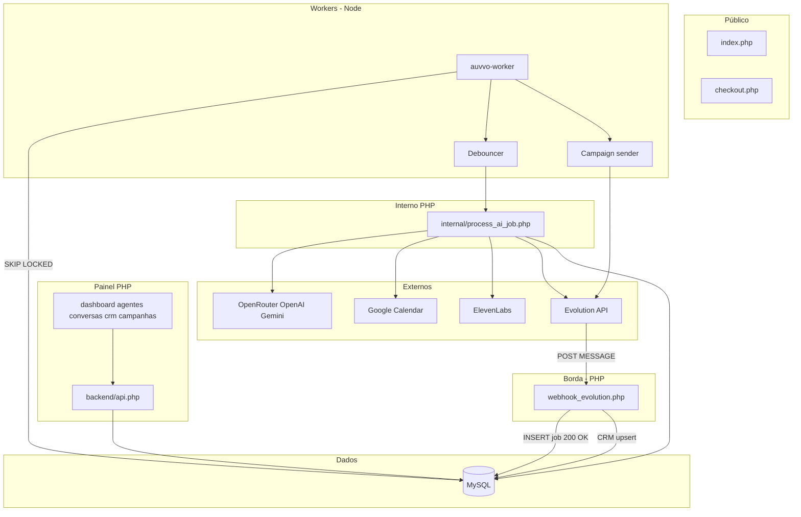
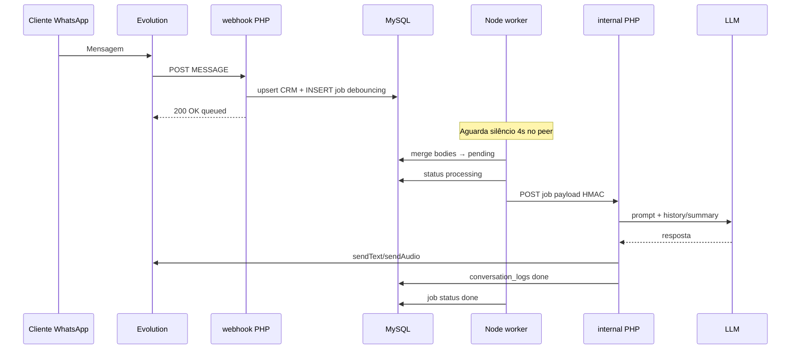

# Arquitetura alvo — Auvvo v2

Documento **to-be** para o programa de escala (Harness Engineering). Complementa [DOCUMENTACAO.md](./DOCUMENTACAO.md) (as-is).

---

## 1. Objetivos arquiteturais

| Objetivo | Métrica de sucesso |
|----------|-------------------|
| Borda rápida | Webhook Evolution responde **&lt; 200 ms** (p95) |
| Escala concorrente | **100+** mensagens simultâneas sem esgotar workers PHP-FPM |
| Custo previsível | Debounce + rate limit reduzem chamadas LLM redundantes |
| Confiabilidade | Jobs com retry (3x) e dead letter (`failed`) |
| Manutenibilidade | **Um** pipeline de IA (`auvvo_run_ai_reply`) |
| Sem cron no core | Worker **Node contínuo** (PM2/systemd), não `* * * * *` para IA |

---

## 2. Diagrama de componentes



---

## 3. Responsabilidades por camada

### 3.1 `webhook_evolution.php` (borda — PHP)

**Faz:**

- Validar payload JSON
- Resolver agente (`evolution_token` / `instance`)
- `Contacts::upsertFromWebhook`
- Handoff por palavra-chave / risco
- Verificar IA pausada → log fallback, **sem** LLM
- Dedup (`webhook_message_dedup` / `dedupe_key` na fila)
- Suprimir eco (`auvvo_inbound_echoes_last_reply`)
- **INSERT** `auvvo_ai_jobs` (status inicial `debouncing` ou `pending`)
- **HTTP 200** imediato `{ "ok": true, "queued": true }`

**Não faz (após migração):**

- `callOpenAI` / `auvvo_run_ai_reply` em produção
- `GET_LOCK` longo para pipeline IA
- `set_time_limit(0)` no request HTTP

### 3.2 `auvvo-worker` (Node — processo contínuo)

**Faz:**

- Loop com intervalo 200–500 ms
- Claim jobs: `FOR UPDATE SKIP LOCKED`
- **Debouncer:** agrupar mensagens do mesmo `(agent_id, lock_peer)` em janela configurável (default 4s)
- Rate limit antes de chamar LLM (por peer e por agente)
- Chamar `POST /backend/internal/process_ai_job.php` com HMAC
- Atualizar `attempts`, `last_error`, `status`
- Processar fila de **campanhas** (substitui `cron_campaigns.php`)

**Não faz:**

- Duplicar regra de prompt/GCal/handoff (permanece no PHP)

### 3.3 `backend/internal/process_ai_job.php` (PHP — uso interno)

**Faz:**

- Validar header `X-Auvvo-Worker` + assinatura HMAC (`auvvo_worker_hmac_secret()`)
- Carregar agente + settings
- Invocar `auvvo_run_ai_reply()` com `body` já concatenado (pós-debounce)
- Retornar JSON `{ ok, error? }`

**Não expõe:** sessão de usuário nem CSRF de painel.

### 3.4 Painel existente

Sem mudança estrutural na Fase 1; Fase 2 adiciona SSE/polling em `conversas.php` e endpoints de eventos.

---

## 4. Fluxo de mensagem inbound (detalhado)



---

## 5. Modos de operação (.env)

| Variável | Produção | Desenvolvimento local |
|----------|----------|------------------------|
| `WEBHOOK_AI_MODE` | `queue` | `queue` (recomendado) ou `inline` só para debug |
| `WEBHOOK_DEBOUNCE_SEC` | `4` | `2` |
| `WORKER_AI_MAX_ATTEMPTS` | `3` | `3` |
| `WORKER_POLL_MS` | `300` | `500` |
| `RATE_LIMIT_PER_PEER_MIN` | `30` | `60` |

**Deprecar:** `inline` como default em produção.

---

## 6. Debouncer — design

### Estados do job

| status | Significado |
|--------|-------------|
| `debouncing` | Acumulando mensagens; `flush_at = NOW() + N sec` |
| `pending` | Pronto para processar |
| `processing` | Worker claim ativo |
| `done` | Sucesso |
| `failed` | Esgotou tentativas |

### Regra de merge

- Chave lógica: `(agent_id, lock_peer)` — uma fila por conversa.
- Nova mensagem enquanto `debouncing`: **APPEND** em `body` com `\n`, renova `flush_at`.
- Worker só processa quando `status = pending` AND (`flush_at IS NULL OR flush_at <= NOW()`).

### Dedup

- Manter `dedupe_key` por message id Evolution quando existir.
- Debounce substitui múltiplos jobs do mesmo peer por **um** job merged (UPDATE, não INSERT duplicado).

---

## 7. Rate limit e anti-loop

### 7.1 Rate limit (worker, antes do LLM)

| Regra | Default |
|-------|---------|
| Mínimo intervalo entre respostas IA ao mesmo peer | 2 s |
| Máximo respostas IA / peer / minuto | 30 |
| Máximo jobs processados / agente / minuto | 60 |

Implementação sugerida: tabela `auvvo_rate_buckets` ou Redis (Fase 2 opcional).

### 7.2 Anti loop bot × bot

Camadas (em ordem):

1. `auvvo_inbound_echoes_last_reply` (já existe)
2. Contador: &gt; N respostas IA seguidas sem mensagem humana distinta → pausar IA 1h + log
3. Detecção de padrão repetitivo (mesma resposta 3x) → suprimir

---

## 8. Contexto LLM (Fase 2)

### Hoje (as-is)

- `getConversationHistory(..., 10)` — últimos 10 turnos completos.

### Alvo

```
prompt = system (MasterPromptBuilder)
       + contact_memory (CRM JSON)
       + conversation_summary (tabela summaries)
       + last_3_turns
       + current_message (debounced)
```

Job assíncrono de sumarização após 15 turnos ou estimativa de tokens &gt; limite.

---

## 9. Campanhas sem cron

### Hoje

`cron_campaigns.php` — batch 20 msgs, sleep 2–5s.

### Alvo

- Tabela `campaign_send_queue` ou flag em `campaigns` + cursor no CSV.
- Worker Node: respeitar `CAMPAIGN_MSGS_PER_MINUTE` (ex: 12/min).
- Mesmo pool de conexões Evolution unificado (ver §10).

---

## 10. Unificação Evolution API

**Problema as-is:** webhook usa `EVOLUTION_API_*` global; campanhas usam `settings.evolution_url/key` por tenant.

**Alvo:**

1. Resolver credenciais por `agent.user_id` → `settings` com fallback `.env`.
2. Documentar precedência em `db.php`: `tenant settings` &gt; `global env`.
3. Validar em [MATRIZ-VALIDACAO.md](./MATRIZ-VALIDACAO.md) campanha + webhook + manual send.

---

## 11. Tempo real no inbox (Fase 2)

### Opção recomendada (v1): SSE

- Endpoint: `backend/events.php?stream=conversations` (sessão + token curto).
- Eventos: `message.new`, `conversation.updated`, `handoff`.
- `conversas.php`: `EventSource` atualiza lista e chat ativo.

### Opção v2 (se necessário)

- Node + Redis pub/sub + WebSocket para multi-tab.

---

## 12. Segurança

| Superfície | Controle |
|------------|----------|
| Painel | Sessão + CSRF |
| `api.php` | Sessão + CSRF em POST |
| `webhook_evolution.php` | IP allowlist / secret header (implementar) |
| `internal/process_ai_job.php` | HMAC + apenas localhost/VPN |
| Node worker | Credenciais DB read/write limitadas (opcional) |

---

## 13. Observabilidade

### Logs estruturados (JSON)

- `webhook_trace.log` — manter
- Worker: `worker.log` — `job_id`, `phase`, `duration_ms`, `llm_http`

### Métricas mínimas (dashboard interno Fase 1)

- Jobs `pending` / `debouncing` / `processing` / `failed`
- Tempo médio fila → resposta enviada
- Taxa 429 LLM
- Campanhas: enviadas / falhas / minuto

---

## 14. Deploy

```
┌─────────────────┐     ┌──────────────────┐
│  Apache/PHP     │     │  auvvo-worker    │
│  (painel+WH)    │     │  PM2 / systemd   │
└────────┬────────┘     └────────┬─────────┘
         │                       │
         └───────────┬───────────┘
                     ▼
              ┌─────────────┐
              │   MySQL     │
              └─────────────┘
```

**Checklist deploy:**

1. Migrar SQL ([SCHEMA-EVOLUCAO.md](./SCHEMA-EVOLUCAO.md))
2. `WEBHOOK_AI_MODE=queue`
3. Subir worker Node
4. Smoke test [MATRIZ-VALIDACAO.md](./MATRIZ-VALIDACAO.md) Fase 1
5. Desabilitar cron de IA (nunca existiu); migrar cron de campanhas

---

## 15. O que não muda nesta arquitetura

- Painel PHP server-rendered
- `MasterPromptBuilder` / `AgentTemplates`
- AbacatePay / Stripe webhooks
- Estrutura multi-tenant por `user_id` (sem agências na Fase 1–3)

---

*Referência cruzada: [ROADMAP.md](./ROADMAP.md) · [SCHEMA-EVOLUCAO.md](./SCHEMA-EVOLUCAO.md)*
