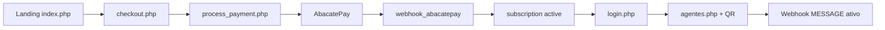
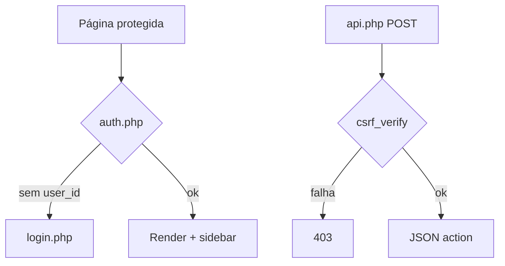

# Auvvo v2 — Documentação Técnica e de Produto

> **As-is** — estado atual do código. Para evolução planejada ver [ROADMAP.md](./ROADMAP.md) e [ARQUITETURA-ALVO.md](./ARQUITETURA-ALVO.md).  
> Última revisão: maio/2026 · Índice: [README.md](./README.md)

---

## Índice

1. [Visão geral](#1-visão-geral)
2. [Estrutura do projeto](#2-estrutura-do-projeto)
3. [Configuração e ambiente](#3-configuração-e-ambiente)
4. [Autenticação e segurança](#4-autenticação-e-segurança)
5. [Modelo de dados](#5-modelo-de-dados)
6. [Páginas e interface](#6-páginas-e-interface)
7. [API interna (`backend/api.php`)](#7-api-interna-backendapiphp)
8. [Agentes de IA e prompts](#8-agentes-de-ia-e-prompts)
9. [WhatsApp e webhooks](#9-whatsapp-e-webhooks)
10. [Pipeline de resposta com IA](#10-pipeline-de-resposta-com-ia)
11. [CRM](#11-crm)
12. [Campanhas](#12-campanhas)
13. [Pagamentos e assinaturas](#13-pagamentos-e-assinaturas)
14. [E-mail transacional](#14-e-mail-transacional)
15. [Internacionalização](#15-internacionalização)
16. [Design system](#16-design-system)
17. [Workers, cron e filas](#17-workers-cron-e-filas)
18. [Diagramas de fluxo](#18-diagramas-de-fluxo)
19. [Gaps e débitos técnicos](#19-gaps-e-débitos-técnicos)

---

## 1. Visão geral

### 1.1 Propósito

Auvvo é um **SaaS multi-tenant** onde cada usuário (`users`) possui:

- Configurações globais (`settings`) — empresa, chaves de API, Evolution, calendário
- Um ou mais **agentes** (`agents`) — cada um com instância WhatsApp, modelo LLM, prompt e base de conhecimento
- **Conversas** registradas em `conversation_logs` com estados de pausa/handoff
- **Contatos CRM** sincronizados a partir do WhatsApp
- **Campanhas** de disparo em massa via CSV

### 1.2 Stack tecnológica

| Camada | Tecnologia |
|--------|------------|
| Backend | PHP (strict types em arquivos recentes), PDO/MySQL |
| Frontend painel | PHP server-rendered + CSS (`app.css`) + Phosphor Icons + Fetch API |
| Frontend marketing | `index.php` + `style.css` + Font Awesome |
| Roteamento | Apache `.htaccess` — URLs amigáveis (`/dashboard` → `dashboard.php`) |
| WhatsApp | Evolution API (Go) |
| LLM | OpenRouter (padrão global), OpenAI/Gemini (por tenant) |
| Voz | ElevenLabs (opcional por agente) |
| Pagamentos | AbacatePay (checkout atual), Stripe (paralelo) |
| Dependência NPM | `tesseract.js` (uso pontual, ex. OCR em conhecimento) |

### 1.3 Planos comerciais

| Plano | Preço (UI) | ID interno |
|-------|------------|------------|
| Mensal | R$ 69,90/mês | `mensal` |
| Anual | R$ 297/ano | `anual` |

Checkout: `checkout.php?plan=mensal|anual` → `backend/process_payment.php` → redirect gateway.

---

## 2. Estrutura do projeto

```
auvvov2/
├── index.php              # Landing marketing
├── login.php              # Autenticação
├── checkout.php           # Cadastro + plano
├── dashboard.php          # KPIs e métricas
├── agentes.php            # CRUD agentes + wizard + WhatsApp
├── conversas.php          # Inbox de chat
├── crm.php                # Pipeline de contatos
├── campanhas.php          # Disparo em massa
├── conhecimento.php       # Base de conhecimento (rota secundária)
├── configuracoes.php      # Integrações e chaves
├── sobre.php, termos.php, privacidade.php
├── includes/
│   ├── auth.php           # Guard + CSRF
│   ├── i18n.php           # Traduções
│   ├── sidebar.php        # Nav do painel
│   └── marketing.php      # Base URL, tracking, WhatsApp flutuante
├── lang/
│   ├── pt_BR.php, pt.php, en.php, es.php
├── backend/
│   ├── db.php             # .env, PDO, helpers globais
│   ├── api.php            # API JSON única do painel
│   ├── webhook_evolution.php
│   ├── ai_reply.inc.php
│   ├── webhook_ai_pipeline.inc.php
│   ├── ai_queue.inc.php
│   ├── EvolutionAPI.php, Contacts.php
│   ├── AgentTemplates.php, MasterPromptBuilder.php
│   ├── GoogleCalendar.php
│   ├── PaymentGateway.php, process_*.php
│   ├── cron_campaigns.php, worker_daemon.php
│   ├── webhook_abacatepay.php, webhook_stripe.php
│   └── mail/              # SMTP + templates HTML
├── uploads/
│   ├── campaigns/         # CSVs
│   └── knowledge/         # Arquivos por agente
├── style.css              # Marketing
├── app.css                # Painel
├── design.json            # Tokens de design
├── .env.example
└── .htaccess              # Rewrite + LiteSpeed noabort
```

---

## 3. Configuração e ambiente

Arquivo: **`.env`** (modelo em `.env.example`). Carregado em `backend/db.php`.

### 3.1 Variáveis principais

| Variável | Função |
|----------|--------|
| `DB_HOST`, `DB_NAME`, `DB_USER`, `DB_PASS` | MySQL (padrão `Auvvo_saas`) |
| `APP_ENV` | `development` \| `production` |
| `APP_BASE_URL` | URL pública (webhooks, redirects OAuth) |
| `APP_HTTP_PREFIX` | Subpasta opcional (ex. deploy em `/agentes/`) |
| `EVOLUTION_API_URL`, `EVOLUTION_API_KEY` | Servidor Evolution global |
| `WEBHOOK_SECRET` | Reservado (comentários no código) |
| `OPENROUTER_API_KEY`, `OPENROUTER_DEFAULT_MODEL` | LLM padrão |
| `GEMINI_API_KEY` | Fallback global Gemini |
| `GOOGLE_OAUTH_CLIENT_ID`, `GOOGLE_OAUTH_CLIENT_SECRET` | Calendar |
| `PAYMENT_GATEWAY` | `abacatepay` (padrão) ou `stripe` |
| `ABACATEPAY_*` | API, produtos, webhook secret |
| `STRIPE_*` | Opcional |
| `SMTP_*`, `MAIL_*`, `SUPPORT_EMAIL` | E-mail |
| `WEBHOOK_AI_MODE` | `inline` (padrão), `queue`, `mysql`, `cron` |
| `WEBHOOK_TRACE_LOG` | Log diagnóstico em `webhook_trace.log` |
| `WEBHOOK_LLM_CURL_TIMEOUT_SEC` | Timeout chamadas LLM |

### 3.2 Helpers globais (`db.php`)

- `app_http_url($path)` — URLs absolutas com prefixo
- `auvvo_worker_hmac_secret()` — HMAC para workers internos
- `auvvo_whatsapp_peer_digits($jid)` — normalização JID WhatsApp
- Funções de chamada LLM (OpenRouter/OpenAI/Gemini) usadas no webhook

---

## 4. Autenticação e segurança

### 4.1 Sessão PHP

Após login bem-sucedido (`login.php`):

- `$_SESSION['user_id']`
- `$_SESSION['user_name']`
- `$_SESSION['csrf_token']` (regenerado no login)
- Opcional: `$_SESSION['user_plan']`

### 4.2 Páginas protegidas

Toda página do painel inclui `includes/auth.php` **antes** do HTML. Sem `user_id` → redirect `login`.

### 4.3 CSRF

- Forms: `csrf_field()` → `csrf_token` no POST
- AJAX: header `X-CSRF-TOKEN` ou campo no body
- `backend/api.php`: POST exige `csrf_verify()`
- `process_payment.php`, `agentes.php`: validação própria

### 4.4 Rate limit (login)

Até **10 tentativas / 15 minutos** por IP (implementado em `login.php`).

### 4.5 Webhooks externos

| Origem | Proteção |
|--------|----------|
| Evolution | Sem HMAC dedicado no código analisado — confiar em rede/firewall |
| AbacatePay | `?webhookSecret=` + header `X-Webhook-Signature` (HMAC) + `webhook_event_log` |
| Stripe | `STRIPE_WEBHOOK_SECRET` via SDK |
| Workers internos | POST + `X-Auvvo-Worker` + payload assinado com `auvvo_worker_hmac_secret()` |

---

## 5. Modelo de dados

> Schema inferido do código; não há migrations versionadas no repositório.

### 5.1 `users`

Usuário SaaS: `name`, `email`, `password_hash`, `stripe_customer_id`.

### 5.2 `settings` (1:1 com user)

Empresa (`company_name`, `company_niche`, `company_site`), chaves (`openai_key`, `gemini_key`, `elevenlabs_key`), tokens de gateways (Mercado Pago, PagSeguro, Cielo, Efi — stubs), `evolution_url`, `evolution_key`, `webhook_url`, flags Google Calendar.

### 5.3 `subscriptions`

`user_id`, `plan_id` (`mensal`|`anual`), `gateway`, `subscription_id`, `status`, `current_period_end`.

Status observados: `active`, `incomplete`, `past_due`, `canceled`.

### 5.4 `agents`

| Campo | Descrição |
|-------|-----------|
| `agent_type` | `Auvvo`, `vendedor`, `atendente`, `suporte`, `sdr`, `restaurante` |
| `name`, `role` | Identidade |
| `prompt_base` | Personalização do usuário |
| `type_config` | JSON — parâmetros dinâmicos por tipo |
| `model`, `temperature`, `max_tokens` | LLM |
| `response_delay` | Atraso simulado de digitação |
| `audio_enabled`, `audio_voice` | ElevenLabs |
| `handoff_*` | Regras de transbordo humano |
| `bot_language` | Idioma de resposta |
| `status` | `draft`, `offline`, `online`, `waiting_qr` |
| `evolution_instance`, `evolution_token` | Pareamento WhatsApp |

### 5.5 `blueprints`

Templates reutilizáveis de agente (sem instância Evolution).

### 5.6 Conversas

- **`conversation_logs`**: `incoming_msg`, `response_msg`, `type` (`ai`, `manual`, `handoff`, `fallback`), timestamps; colunas opcionais `ai_reply_claimed_at`, `ai_reply_completed_at`
- **`conversation_states`**: `ia_paused_until`, `manual_owner_user_id`
- **`handoff_summaries`**: resumo gerado na transferência
- Tabelas anti-duplicação/throttle: `webhook_message_dedup`, `webhook_fallback_throttle`, `manual_send_throttle`, `manual_message_dedup`

### 5.7 `knowledge_base`

`agent_id`, arquivos (`file_name`, `original_name`, `file_type`, `content`), `status` (processando/treinado/falhou).

### 5.8 `campaigns`

`user_id`, `agent_id`, `message`, `csv_file`, contadores, `status` (`draft`, `scheduled`, `running`, `paused`, `completed`), `scheduled_at`.

### 5.9 CRM

- **`contacts`**: `jid`, `phone`, `stage`, `tags` (JSON), `notes`, `custom_fields` (JSON)
- **`contact_activities`**: timeline de interações

Estágios Kanban: `new`, `contacted`, `qualified`, e outros usados na UI.

### 5.10 Outras

- `google_calendar_tokens` — OAuth por usuário
- `webhook_event_log` — idempotência AbacatePay
- `transactional_email_sent` — dedupe de e-mails
- `auvvo_ai_jobs` / `auvvo_ai_queue` — filas criadas em runtime

---

## 6. Páginas e interface

### 6.1 Públicas

| Rota | Arquivo | Função |
|------|---------|--------|
| `/` | `index.php` | Landing, preços, FAQ, vídeo |
| `/login` | `login.php` | Login + idioma |
| `/checkout` | `checkout.php` | Registro + plano |
| `/sobre` | `sobre.php` | Institucional |
| `/termos`, `/privacidade` | Legal |

### 6.2 Painel (autenticado)

| Rota | Arquivo | Função principal |
|------|---------|------------------|
| `/dashboard` | `dashboard.php` | KPIs, gráfico 7 dias, funil, agentes, alertas |
| `/agentes` | `agentes.php` | Lista, wizard, Evolution QR, blueprints |
| `/conversas` | `conversas.php` | Inbox, pausa, envio manual |
| `/crm` | `crm.php` | Kanban/lista, painel lateral, export |
| `/campanhas` | `campanhas.php` | CSV + mensagem + agendamento |
| `/conhecimento` | `conhecimento.php` | KB dedicada (fora do menu) |
| `/configuracoes` | `configuracoes.php` | Chaves, empresa, Calendar, gateways |

### 6.3 Padrão de interação frontend

- **Mutações pesadas:** form POST clássico (`agentes.php`, `campanhas.php` → `process_campaign.php`)
- **Interações dinâmicas:** `fetch('backend/api.php?action=...')` com JSON
- **Sem SPA framework** — estado inicial embutido em PHP/JSON onde necessário (`conversas.php`)

---

## 7. API interna (`backend/api.php`)

**Entrada:** `?action=<nome>` (GET ou POST)  
**Auth:** sessão `user_id`  
**POST:** `csrf_verify()`  
**Resposta:** JSON (exceto `crm_export_csv` → download CSV)

### 7.1 WhatsApp / Evolution

| Action | Descrição |
|--------|-----------|
| `evolution_ping` | Testa conectividade |
| `evolution_connect` | Cria/reusa instância, configura webhook, retorna QR |
| `evolution_status` | Status + atualiza `agents.status` |
| `evolution_disconnect` | Remove instância e limpa token |

### 7.2 Conhecimento

| Action | Descrição |
|--------|-----------|
| `get_master_prompt` | Prompt completo via `MasterPromptBuilder` |
| `extract_knowledge` | Extrai texto de item da KB |
| `list_knowledge` | Lista arquivos/textos |
| `inline_upload_knowledge` | Upload até 50MB (txt, csv, pdf, docx) |
| `inline_save_text` | Texto manual |
| `inline_delete_knowledge` | Remove item + arquivo |

### 7.3 Conversas

| Action | Descrição |
|--------|-----------|
| `get_conversation_state` | Estado de pausa da IA |
| `get_handoff_summary` | Último resumo de transbordo |
| `set_conversation_pause` | Pausa com duração (15min–24h) |
| `send_manual_message` | Envio humano via Evolution + log `manual` |

### 7.4 CRM

| Action | Descrição |
|--------|-----------|
| `crm_get_contacts` | Lista + contagem por estágio |
| `crm_get_contact` | Detalhe + atividades + mensagens |
| `crm_save_contact` | Create/update |
| `crm_delete_contact` | Remove |
| `crm_update_stage` | Move no Kanban |
| `crm_add_activity` | Nota/ligação/e-mail/etc. |
| `crm_add_tag` / `crm_remove_tag` | Tags JSON |
| `crm_export_csv` | Exportação |

### 7.5 Outros

| Action | Descrição |
|--------|-----------|
| `google_calendar_create_event` | Evento manual no calendário conectado |
| `gemini_generate_prompt` | Geração local de sugestão de prompt (sem chamar API Gemini necessariamente) |

---

## 8. Agentes de IA e prompts

### 8.1 Tipos (`AgentTemplates`)

| Tipo | Perfil |
|------|--------|
| `Auvvo` | Orquestrador / primeiro contato |
| `vendedor` | Venda consultiva |
| `atendente` | Dúvidas e satisfação |
| `suporte` | Pós-venda técnico |
| `sdr` | Qualificação (UI: “Em breve”) |
| `restaurante` | Pedidos delivery |

Cada tipo define **metodologia, tom e objetivo** no prompt mestre.

### 8.2 `MasterPromptBuilder` — camadas

1. Template do tipo (`AgentTemplates::get`)
2. Personalização (`prompt_base` + `type_config` JSON)
3. Base de conhecimento (conteúdo de `knowledge_base`)
4. Regras de comportamento (modelo, temperatura, delay)
5. Contexto da empresa (nome, nicho, site)
6. Regras de transbordo (`handoff_rules`, mensagem)
7. Metadados (data, versão, idioma `bot_language`)

### 8.3 Wizard em `agentes.php`

Abas: **Identidade**, **Prompt**, **Conhecimento**, **Links**, **Follow-up**, **Pausa**, **Conexão WhatsApp**.

Score de “prontidão” na UI; conexão Evolution com polling de status.

---

## 9. WhatsApp e webhooks

### 9.1 `EvolutionAPI.php`

Encapsula REST Evolution: criar instância, QR, status, enviar texto/áudio/mídia, configurar webhook da instância.

**Eventos inscritos na conexão:** `MESSAGE`, `CONNECTION`, `QRCODE`.

### 9.2 `webhook_evolution.php`

Fluxo principal para mensagens recebidas:

1. Parse JSON (`event`, `data`, `instanceToken`, `instanceName`)
2. Evento **`MESSAGE`** (apenas `IsFromMe = false`):
   - Resolve JID (suporte LID/PN)
   - Carrega agente por token/instância
   - `Contacts::upsertFromWebhook` → CRM
   - Valida chaves LLM disponíveis
   - **Handoff** por palavra-chave ou termos de risco
   - Se IA pausada → log `fallback`, sem resposta automática
   - **Modo inline (padrão):** `auvvo_run_ai_reply()` no mesmo request HTTP
   - **Modo queue:** INSERT em `auvvo_ai_jobs`, resposta `{"queued":true}`
3. Eventos de **conexão** → atualiza `agents.status` (`online`, `waiting_qr`)

### 9.3 Envio de resposta

Ordem típica: histórico `conversation_logs` → chamada LLM → parse `[[GCAL_EVENT]]` (Google Calendar) → ElevenLabs (se áudio) → Evolution `sendText` / `sendAudio`.

---

## 10. Pipeline de resposta com IA

### 10.1 Implementações

| Arquivo | Uso |
|---------|-----|
| `ai_reply.inc.php` | `auvvo_run_ai_reply()` — **inline** no webhook |
| `webhook_ai_pipeline.inc.php` | `auvvo_webhook_run_ai_pipeline()` — workers async |
| `ai_queue.inc.php` | Enfileiramento em `auvvo_ai_jobs` |

### 10.2 Modos (`WEBHOOK_AI_MODE`)

| Valor | Comportamento |
|-------|---------------|
| `inline` (padrão) | IA no mesmo request do Evolution |
| `queue` / `mysql` / `cron` | Job na fila MySQL |

### 10.3 Workers HTTP

- `webhook_async_worker.php` — `fastcgi_finish_request` + HMAC
- `webhook_litespeed_ai_worker.php` — CLI com arquivo JSON (LiteSpeed)

### 10.4 Handoff (transbordo)

Gatilhos configuráveis no agente; gera `handoff_summaries` e mensagem ao cliente; pausa automática da IA para atendimento humano em `conversas.php`.

---

## 11. CRM

### 11.1 Sincronização automática

Todo contato que envia mensagem no webhook passa por `Contacts::upsertFromWebhook` — cria/atualiza `contacts` e `last_contact_at`.

### 11.2 UI (`crm.php`)

- Visualização **Kanban** (drag-and-drop) e **lista**
- Filtros: busca (debounce 300ms), agente, estágio
- Painel lateral: dados, tags, atividades, mini-chat (mensagens do log)
- Export: `crm_export_csv`

### 11.3 Estágios

Pipeline customizável na prática via `crm_update_stage`; valores padrão incluem `new`, `contacted`, `qualified`.

---

## 12. Campanhas

### 12.1 Criação (`campanhas.php`)

- Upload CSV para `uploads/campaigns/`
- Variáveis na mensagem: `{{nome}}`, `{{telefone}}`
- Envio imediato ou `scheduled_at`
- Submit → `backend/process_campaign.php`

### 12.2 Execução (`cron_campaigns.php`)

- Rodar ~a cada 1 minuto (cron do servidor)
- Processa campanhas `scheduled` / `running`
- Até **20 mensagens por execução**
- `sleep(2–5)` entre envios (anti-ban)
- Usa credenciais Evolution de `settings` **do usuário** (diferente do webhook global)

---

## 13. Pagamentos e assinaturas

### 13.1 Checkout (`process_payment.php`)

1. Valida CSRF, plano, campos (senha mín. 8 caracteres)
2. Cria ou reutiliza `users` por e-mail
3. Insere `subscriptions` com `status = incomplete` se não existir
4. Redireciona para AbacatePay (`PaymentGateway`)

### 13.2 Webhook AbacatePay (`webhook_abacatepay.php`)

| Evento | Ação |
|--------|------|
| `subscription.completed` | Ativa assinatura + e-mail boas-vindas |
| `subscription.renewed` | Estende `current_period_end` + e-mail |
| `subscription.cancelled` | `canceled` + e-mail |

Identificação: `externalId` formato `auvvo_u{userId}_{plan}` ou metadata.

### 13.3 Stripe (`webhook_stripe.php`)

Eventos: `checkout.session.completed`, `customer.subscription.updated/deleted`, `invoice.payment_failed`.

### 13.4 Gateways stub

`PaymentGateway.php` referencia Mercado Pago, PagSeguro, Cielo, Efi — campos em `settings`, sem fluxo completo no checkout atual.

---

## 14. E-mail transacional

Pasta `backend/mail/`:

| Componente | Função |
|------------|--------|
| `SmtpTransport.php` | Envio SMTP |
| `TemplateRenderer.php` | HTML templates |
| `SubscriptionMailer.php` | Orquestração |
| `TransactionalEmail.php` | Dedupe via `transactional_email_sent` |
| `EmailDefinitions.php` | Metadados dos tipos |

**Templates:** `subscription_welcome`, `subscription_payment_receipt`, `subscription_payment_failed`, `subscription_renewed`, `subscription_cancelled`, `subscription_expiring_reminder`.

---

## 15. Internacionalização

**Arquivo central:** `includes/i18n.php`

**Detecção (ordem):** `?set_lang=` → sessão → cookie `Auvvo_lang` (1 ano) → `Accept-Language` → `pt_BR`

**Funções:**

- `t('chave', ['param' => 'x'])` — substitui `{param}`
- `ta('chave')` — arrays
- `lang_url($code)` — troca idioma preservando query string
- `current_lang()`, `lang_html()`

**Idiomas:** `pt_BR`, `es`, `en` (arquivos em `lang/`)

**Cobertura incompleta:**

- `index.php`, `checkout.php` — PT-BR fixo
- `crm.php`, partes de `agentes.php` — strings hardcoded

**JS:** `conversas.php` exporta objeto `I18N` via `json_encode(t(...))`.

---

## 16. Design system

Arquivo **`design.json`** documenta:

- **Estilo:** dark glassmorphism + gradientes pastel (Orchid Haze, Azure Mist, Coral Bloom)
- **Fontes:** Space Grotesk (títulos), Inter (corpo), JetBrains Mono (terminal)
- **Layout app:** grid 280px sidebar + conteúdo
- **Componentes:** sidebar, cards, wizard steps, botões primary/secondary/ghost, inputs, blocos terminal

CSS implementado em **`app.css`** (painel) e **`style.css`** (marketing).

---

## 17. Workers, cron e filas

| Script | Invocação | Função |
|--------|-----------|--------|
| `cron_campaigns.php` | Cron sistema | Disparo campanhas |
| `worker_daemon.php` | CLI legado | Consome `auvvo_ai_queue` (JSON) — não é fluxo principal |
| `webhook_async_worker.php` | HTTP interno | Pipeline IA pós-ACK |
| `webhook_litespeed_ai_worker.php` | CLI | Idem para LiteSpeed |
| *(ausente)* `process_ai_queue.php` | — | Consumidor `auvvo_ai_jobs` referenciado mas não no repo |

**LiteSpeed:** `.htaccess` define `noabort` e `noconnectiontimeout` para requests longos.

---

## 18. Diagramas de fluxo

### 18.1 Mensagem WhatsApp → resposta IA (modo inline)

```mermaid
sequenceDiagram
    participant WA as WhatsApp Cliente
    participant Evo as Evolution API
    participant WH as webhook_evolution.php
    participant DB as MySQL
    participant LLM as OpenRouter/OpenAI/Gemini
    participant GCal as Google Calendar
    participant EL as ElevenLabs

    WA->>Evo: Mensagem
    Evo->>WH: POST MESSAGE
    WH->>DB: Agente + CRM upsert
    alt Handoff ou IA pausada
        WH->>DB: Log fallback/handoff
        WH-->>Evo: Sem resposta IA
    else IA ativa
        WH->>DB: Histórico conversation_logs
        WH->>LLM: Prompt mestre + KB
        LLM-->>WH: Texto resposta
        opt [[GCAL_EVENT]]
            WH->>GCal: Criar evento
        end
        opt Áudio habilitado
            WH->>EL: TTS
            WH->>Evo: sendAudio
        else Texto
            WH->>Evo: sendText
        end
        WH->>DB: conversation_logs type=ai
    end
    Evo->>WA: Entrega
```

### 18.2 Onboarding de cliente



### 18.3 Autenticação do painel



---

## 19. Gaps e débitos técnicos

| Item | Severidade | Detalhe |
|------|------------|---------|
| `process_ai_queue.php` ausente | Alta (se usar queue) | Jobs em `auvvo_ai_jobs` sem consumidor |
| Dois pipelines IA | Média | Risco de divergência inline vs async |
| Evolution credenciais | Média | Global no webhook vs por user nas campanhas |
| Inbox sem realtime | Baixa | Snapshot no page load |
| i18n parcial | Baixa | Landing/CRM/wizard |
| `conhecimento.php` órfão na nav | Baixa | UX confusa |
| Schema sem migrations | Média | Colunas criadas em runtime (ex. AI job tables) |
| Badge conversas estático | Cosmético | “2” hardcoded na sidebar |
| Gateways MP/Cielo/etc. | Info | Apenas campos em settings |
| WhatsApp não oficial | Produto | Política Meta — documentado no FAQ |

---

## Referência rápida de arquivos críticos

| Arquivo | Responsabilidade |
|---------|------------------|
| `backend/db.php` | Bootstrap, env, PDO, LLM helpers |
| `backend/api.php` | API REST interna do painel |
| `backend/webhook_evolution.php` | Entrada WhatsApp |
| `backend/ai_reply.inc.php` | Resposta IA inline |
| `backend/MasterPromptBuilder.php` | Montagem do prompt |
| `backend/AgentTemplates.php` | Perfis de agente |
| `backend/Contacts.php` | CRM + webhook sync |
| `backend/EvolutionAPI.php` | Client HTTP Evolution |
| `includes/auth.php` | Guard de sessão |
| `includes/i18n.php` | Traduções |

---

*Para resumo executivo, consulte [`BRIEF.md`](./BRIEF.md).*
