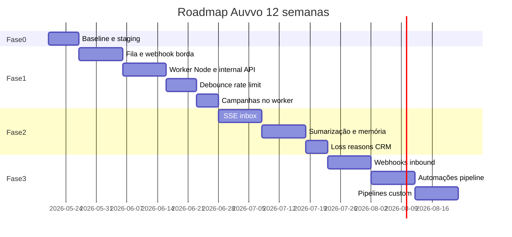

# Roadmap completo — Auvvo v2

**Programa:** Escala, confiabilidade e crescimento comercial  
**Horizonte:** 12 semanas (3 meses)  
**Última atualização:** maio/2026  

**Operação com fila:** `WEBHOOK_AI_MODE=queue` + processo `auvvo-worker` (Node). Sem worker ativo, jobs ficam em `auvvo_ai_jobs` sem resposta.

Documentos relacionados: [README](./README.md) · [ARQUITETURA-ALVO](./ARQUITETURA-ALVO.md) · [SCHEMA-EVOLUCAO](./SCHEMA-EVOLUCAO.md) · [MATRIZ-VALIDACAO](./MATRIZ-VALIDACAO.md) · [DOCUMENTACAO](./DOCUMENTACAO.md) (as-is)

---

## Sumário executivo

| Fase | Semanas | Objetivo | Entrega principal |
|------|---------|----------|-------------------|
| **0** | 0–1 | Preparação | Ambiente staging, baseline de testes |
| **1** | 1–4 | Escala técnica | Fila + worker Node + debounce + rate limit |
| **2** | 5–8 | Operação humana | Inbox tempo real + contexto compactado + CRM+ |
| **3** | 9–12 | Integrações | Webhooks inbound + automações + pipelines |

**Princípio rector:** nenhuma fase fecha sem **regressão completa** ([MATRIZ-VALIDACAO](./MATRIZ-VALIDACAO.md) seções A + anteriores).

---

## Estado atual vs alvo

| Área | Hoje (as-is) | Alvo (to-be) |
|------|--------------|--------------|
| Webhook IA | `inline` padrão, segura HTTP | Enfileira e 200 OK &lt; 200ms |
| Consumidor fila | `process_ai_queue.php` **ausente** | `auvvo-worker` Node contínuo |
| Campanhas | `cron_campaigns.php` | Worker Node (sem cron) |
| Histórico LLM | 10 turnos | Summary + 3 turnos + memória CRM |
| Inbox | Snapshot no load | SSE / polling |
| Pipelines CRM | Estágios fixos no código | Funis configuráveis (Fase 3) |
| Automações | Nenhuma | Triggers estágio/tag (Fase 3) |

---

## Diagrama do programa



*Datas ilustrativas — ajustar ao início real do sprint.*

---

# Fase 0 — Preparação (semana 0–1)

**Objetivo:** Congelar baseline e ambiente reproduzível antes de mudar arquitetura.

## Épico 0.1 — Baseline de qualidade

| ID | Tarefa | Responsável | Status |
|----|--------|-------------|--------|
| 0.1.1 | Executar suite **A** da [MATRIZ-VALIDACAO](./MATRIZ-VALIDACAO.md) em staging | QA | ⏳ |
| 0.1.2 | Documentar falhas conhecidas em `docs/KNOWN-ISSUES.md` (criar se necessário) | Eng | ⏳ |
| 0.1.3 | Configurar `.env.staging` (Evolution dev, OpenRouter, AbacatePay sandbox) | DevOps | ⏳ |
| 0.1.4 | Tunnel webhook (ngrok/cloudflare) apontando para staging | DevOps | ⏳ |
| 0.1.5 | Backup automático MySQL antes de cada deploy | DevOps | ⏳ |

### Critérios de aceite — Fase 0

- [ ] ≥ 90% dos casos **A.*** passando ou listados como known issue com plano
- [ ] `webhook_trace.log` e logs PHP acessíveis para debug
- [ ] Repositório `auvvo-worker` criado (pasta vazia ou README)

---

# Fase 1 — Fundação de escala (semanas 1–4)

**Objetivo:** Eliminar gargalo inline; processamento assíncrono confiável; proteção de custo.

**Dependências:** Fase 0 concluída.

**Referência:** [ARQUITETURA-ALVO](./ARQUITETURA-ALVO.md) · Migrações [001, 002, 006](./SCHEMA-EVOLUCAO.md)

---

## Épico 1.1 — Webhook como borda (P0)

| ID | Tarefa | Arquivos | Status |
|----|--------|----------|--------|
| 1.1.1 | Alterar default produção: `WEBHOOK_AI_MODE=queue` | `.env.example`, docs | ⏳ |
| 1.1.2 | Remover caminho inline de produção (manter só se `IS_DEV` + flag explícita) | `webhook_evolution.php` | ⏳ |
| 1.1.3 | Garantir resposta 200 antes de qualquer LLM | `webhook_evolution.php` | ⏳ |
| 1.1.4 | Job entra como `debouncing` + `flush_at` | `ai_queue.inc.php`, webhook | ⏳ |
| 1.1.5 | Merge por `(agent_id, lock_peer)` em novo inbound | `webhook_evolution.php` | ⏳ |
| 1.1.6 | Aplicar migração 001 | SQL | ⏳ |

### Critérios de aceite — Épico 1.1

- [ ] Casos **B1.*** da matriz de validação
- [ ] p95 webhook &lt; 200ms (sem chamada LLM no request)

---

## Épico 1.2 — API interna PHP (P0)

| ID | Tarefa | Arquivos | Status |
|----|--------|----------|--------|
| 1.2.1 | Criar `backend/internal/process_ai_job.php` | novo | ⏳ |
| 1.2.2 | Validar HMAC (`X-Auvvo-Signature`, timestamp anti-replay) | internal | ⏳ |
| 1.2.3 | Payload: `job_id`, `agent_id`, `body`, `pending_log_id`, jids | internal | ⏳ |
| 1.2.4 | Chamar único `auvvo_run_ai_reply()` | `ai_reply.inc.php` | ⏳ |
| 1.2.5 | Restringir IP (127.0.0.1 + rede worker) via `.htaccess` ou nginx | infra | ⏳ |
| 1.2.6 | Deprecar uso de `webhook_ai_pipeline.inc.php` em fluxo principal | workers antigos | ⏳ |

### Critérios de aceite — Épico 1.2

- [ ] **B2.5** HMAC inválido → 403
- [ ] Resposta WhatsApp idêntica ao comportamento baseline **A4.***

---

## Épico 1.3 — Worker Node `auvvo-worker` (P0)

| ID | Tarefa | Arquivos | Status |
|----|--------|----------|--------|
| 1.3.1 | Scaffold projeto TypeScript (`mysql2`, `dotenv`, `node-fetch`) | `auvvo-worker/` | ⏳ |
| 1.3.2 | Loop poll + `FOR UPDATE SKIP LOCKED` | `src/worker.ts` | ⏳ |
| 1.3.3 | Lógica debounce: pending quando `flush_at <= NOW()` | `src/debounce.ts` | ⏳ |
| 1.3.4 | HTTP client para internal PHP com HMAC | `src/phpClient.ts` | ⏳ |
| 1.3.5 | Retry exponencial: 5s, 30s, 2min; max 3 | `src/worker.ts` | ⏳ |
| 1.3.6 | PM2 `ecosystem.config.js` + README deploy | `auvvo-worker/` | ⏳ |
| 1.3.7 | Health endpoint opcional `:3001/health` | `src/health.ts` | ⏳ |

### Critérios de aceite — Épico 1.3

- [ ] **B2.1–B2.4**, **B3.*** da matriz
- [ ] Worker reinicia automático após crash (PM2)

---

## Épico 1.4 — Rate limit e anti-loop (P0)

| ID | Tarefa | Arquivos | Status |
|----|--------|----------|--------|
| 1.4.1 | Migração 002 `auvvo_rate_buckets` | SQL | ⏳ |
| 1.4.2 | Checagem no worker antes de chamar PHP | `src/rateLimit.ts` | ⏳ |
| 1.4.3 | Estender anti-loop: N respostas IA sem inbound humano | PHP ou worker | ⏳ |
| 1.4.4 | Config `.env`: `RATE_LIMIT_PER_PEER_MIN`, etc. | `.env.example` | ⏳ |

### Critérios de aceite — Épico 1.4

- [ ] **B4.*** da matriz

---

## Épico 1.5 — Campanhas no worker (P0)

| ID | Tarefa | Arquivos | Status |
|----|--------|----------|--------|
| 1.5.1 | Migração 006 `campaign_send_queue` | SQL | ⏳ |
| 1.5.2 | Ao criar campanha, popular fila (refator `process_campaign.php`) | PHP | ⏳ |
| 1.5.3 | `src/campaignWorker.ts` — N msgs/min | worker | ⏳ |
| 1.5.4 | Unificar resolver Evolution URL/key (tenant &gt; global) | `db.php`, helper | ⏳ |
| 1.5.5 | Marcar `cron_campaigns.php` deprecated; doc migrar | docs | ⏳ |

### Critérios de aceite — Épico 1.5

- [ ] **B5.*** + regressão **A6.***

---

## Épico 1.6 — Observabilidade e unificação (P1)

| ID | Tarefa | Arquivos | Status |
|----|--------|----------|--------|
| 1.6.1 | Widget dashboard: jobs pending/failed | `dashboard.php`, API | ⏳ |
| 1.6.2 | Alerta se fila &gt; 500 pending por 10 min | worker log / cron monitor | ⏳ |
| 1.6.3 | Remover badge estático "2" em conversas | `sidebar.php` | ⏳ |
| 1.6.4 | Teste carga **E1–E3** | k6 script | ⏳ |

### Gate de saída — Fase 1

- [ ] **B6.1** — Suite A inteira com `WEBHOOK_AI_MODE=queue`
- [ ] Testes de carga E aprovados
- [ ] `DOCUMENTACAO.md` atualizado (as-is pós Fase 1)
- [ ] Deploy produção com worker ativo

---

# Fase 2 — Operação e inteligência (semanas 5–8)

**Objetivo:** Humanos enxergam conversas em tempo quase real; LLM mais barata e contextual.

**Dependências:** Fase 1 em produção estável ≥ 1 semana.

**Migrações:** [003, 004, 009](./SCHEMA-EVOLUCAO.md)

---

## Épico 2.1 — Inbox tempo real (P1)

| ID | Tarefa | Arquivos | Status |
|----|--------|----------|--------|
| 2.1.1 | Inserir eventos em `conversation_events` no webhook/log | PHP | ⏳ |
| 2.1.2 | `backend/events.php` — SSE com auth sessão | novo | ⏳ |
| 2.1.3 | `conversas.php` — EventSource + merge mensagens | frontend | ⏳ |
| 2.1.4 | Fallback polling 5s se SSE falhar | JS | ⏳ |
| 2.1.5 | Painel lateral CRM na conversa (dados do contato ativo) | `conversas.php` | ⏳ |

### Critérios de aceite — Épico 2.1

- [ ] **C1.1, C2.2, C2.3** da matriz

---

## Épico 2.2 — Autocompactação de contexto (P1)

| ID | Tarefa | Arquivos | Status |
|----|--------|----------|--------|
| 2.2.1 | Migração 003 `conversation_summaries` | SQL | ⏳ |
| 2.2.2 | Job pós-resposta: se turnos &gt; 15, chamar LLM resumo | `internal/summarize.php` ou worker | ⏳ |
| 2.2.3 | Alterar `getConversationHistory` → summary + 3 turnos | `webhook_evolution.php` / helper | ⏳ |
| 2.2.4 | Extrair fatos → `contacts.memory_json` | prompt + parser | ⏳ |
| 2.2.5 | Injetar memória no `MasterPromptBuilder` | `MasterPromptBuilder.php` | ⏳ |

### Critérios de aceite — Épico 2.2

- [ ] **C2.4, C2.5** — summary e memória persistidos
- [ ] Qualidade resposta ≥ baseline em conversa longa (teste manual 20 turnos)

---

## Épico 2.3 — CRM enriquecido (P1)

| ID | Tarefa | Arquivos | Status |
|----|--------|----------|--------|
| 2.3.1 | Migração 004 `loss_reason`, `memory_json` | SQL | ⏳ |
| 2.3.2 | Modal obrigatório ao mover para estágio "lost" | `crm.php` | ⏳ |
| 2.3.3 | Dashboard: top loss reasons | `dashboard.php` | ⏳ |
| 2.3.4 | Card CRM: exibir memória + última compra (campos manuais) | `crm.php` | ⏳ |
| 2.3.5 | i18n strings CRM hardcoded → `lang/*` | lang | ⏳ |

### Critérios de aceite — Épico 2.3

- [ ] **C2.6** + regressão **A5.***

---

## Épico 2.4 — Débitos UX (P2)

| ID | Tarefa | Status |
|----|--------|--------|
| 2.4.1 | Adicionar `conhecimento` na sidebar OU redirect para agentes#knowledge | ⏳ |
| 2.4.2 | Completar i18n wizard agentes (abas Identidade, etc.) | ⏳ |

### Gate de saída — Fase 2

- [ ] **C2.7** — Regressão A + B + C
- [ ] Métrica: tempo até operador ver msg em handoff &lt; 5s (p95)

---

# Fase 3 — Crescimento comercial (semanas 9–12)

**Objetivo:** Integrações externas e automações que competem com CRMs maduros (Datacrazy-like), sem BPM visual completo.

**Migrações:** [005, 007, 008](./SCHEMA-EVOLUCAO.md)

---

## Épico 3.1 — Webhooks inbound (P1)

| ID | Tarefa | Arquivos | Status |
|----|--------|----------|--------|
| 3.1.1 | UI configurar webhook + mapeamento campos | `configuracoes.php` | ⏳ |
| 3.1.2 | `backend/webhook_inbound.php?slug=` | novo | ⏳ |
| 3.1.3 | Parser JSON path → CRM (nome, email, phone, tags) | PHP | ⏳ |
| 3.1.4 | Templates: Hotmart, Shopify (presets) | docs + UI | ⏳ |
| 3.1.5 | Log e dedupe `inbound_webhook_log` | SQL 007 | ⏳ |

### Critérios de aceite — Épico 3.1

- [ ] **D1.1, D1.2** da matriz

---

## Épico 3.2 — Automações de pipeline (P1)

| ID | Tarefa | Arquivos | Status |
|----|--------|----------|--------|
| 3.2.1 | CRUD `crm_automations` | `automacoes.php` ou em CRM | ⏳ |
| 3.2.2 | Trigger `stage_enter` → `send_whatsapp` | worker/PHP | ⏳ |
| 3.2.3 | Trigger `tag_added` → `pause_ai` | PHP | ⏳ |
| 3.2.4 | Fila de ações para não bloquear UI | tabela ou jobs | ⏳ |

### Critérios de aceite — Épico 3.2

- [ ] **D2.1, D2.2** da matriz

---

## Épico 3.3 — Pipelines customizáveis (P2)

| ID | Tarefa | Arquivos | Status |
|----|--------|----------|--------|
| 3.3.1 | Migração 005 pipelines + stages | SQL | ⏳ |
| 3.3.2 | Seed pipeline "Vendas" default | migration | ⏳ |
| 3.3.3 | UI criar/editar estágios | `crm.php` | ⏳ |
| 3.3.4 | Migrar contatos existentes para default pipeline | script | ⏳ |

### Critérios de aceite — Épico 3.3

- [ ] **D3.1** — 2 funis independentes no Kanban

---

## Épico 3.4 — Backlog estratégico (P3 — pós 12 semanas)

*Não bloqueia release da Fase 3.*

| Feature | Motivo para adiar |
|---------|-------------------|
| Multitenancy agência (switcher empresas) | Refator auth/billing grande |
| Omnichannel (Instagram, etc.) | WhatsApp ainda consolidando |
| BPM visual drag-and-drop | Automações simples cobrem 80% |
| RAG vetorial (pgvector) | Upload texto suficiente na maioria dos casos |
| LTV automático e-commerce | Requer integrações nativas Shopify/Woo |
| i18n landing completa | Marketing, não bloqueia escala |

### Gate de saída — Fase 3

- [ ] **D3.2** — Regressão completa A+B+C+D
- [ ] Documentação usuário: webhooks + automações (help center)

---

# Mapa de features por módulo (produto)

Referência para validar escopo **Datacrazy-like** vs roadmap.

| Feature | Módulo | Fase | Prioridade |
|---------|--------|------|------------|
| Kanban CRM | CRM | ✅ Atual → 3.3 custom | P1 |
| Card perfil rico (LTV, compras) | CRM | 2.3 manual → 3.4 integração | P2 |
| Campos dinâmicos + tags | CRM | ✅ Atual | — |
| Histórico + atividades | CRM | ✅ Atual | — |
| Google Calendar | CRM/IA | ✅ Atual | — |
| Loss reasons | CRM | 2.3 | P1 |
| Inbox omnichannel | Conversas | 2.1 WhatsApp → 3.4+ outros | P1 |
| Handoff + resumo | Conversas | ✅ Atual | — |
| Envio manual + pausa IA | Conversas | ✅ Atual | — |
| Tipos de agente / blueprints | IA | ✅ Atual | — |
| Prompt camadas | IA | ✅ Atual → 2.2 memória | P1 |
| RAG upload | IA | ✅ Atual | — |
| Áudio ElevenLabs | IA | ✅ Atual | — |
| Webhooks in/out | Automação | 3.1 out → 3.1 in | P1 |
| Automações pipeline | Automação | 3.2 | P1 |
| Campanhas broadcast | Automação | ✅ → 1.5 worker | P0 |
| Multi-tenant agência | SaaS | Backlog | P3 |
| Gateways pagamento | SaaS | ✅ Atual | — |
| E-mails transacionais | SaaS | ✅ Atual | — |
| i18n painel | SaaS | 2.4 parcial | P2 |

---

# Riscos e mitigação

| Risco | Impacto | Mitigação |
|-------|---------|-----------|
| Worker Node fora do ar | Mensagens não respondem | PM2 autorestart + alerta fila crescente |
| Duplicar lógica PHP/Node | Bugs divergentes | Internal API PHP única (Épico 1.2) |
| Debounce atrasa demais | UX lenta | Config `WEBHOOK_DEBOUNCE_SEC` por tenant |
| Evolution ban por campanha | Perda de número | Rate limit campanhas (1.5) |
| 429 OpenRouter | Fila lenta | Retry já existe; considerar fila prioridade handoff |
| Migração SQL em prod | Downtime | Backup + janela manutenção |

---

# Definição de Pronto (DoD) — global

Uma tarefa só é **✅ Concluída** quando:

1. Código em `main` / branch release com review.
2. Migração SQL documentada e aplicada em staging.
3. Casos da [MATRIZ-VALIDACAO](./MATRIZ-VALIDACAO.md) da fase marcados.
4. Sem regressão nos casos das fases anteriores.
5. `.env.example` atualizado.
6. Entrada em [DOCUMENTACAO.md](./DOCUMENTACAO.md) se comportamento as-is mudou.

---

# Estrutura de repositório alvo (pós Fase 1)

```
auvvov2/
├── backend/
│   ├── internal/
│   │   └── process_ai_job.php    # NOVO
│   ├── webhook_evolution.php     # só borda
│   └── ...
├── auvvo-worker/                  # NOVO — repo ou subpasta
│   ├── src/
│   ├── package.json
│   └── ecosystem.config.js
└── docs/
    ├── README.md
    ├── ROADMAP.md                 # este arquivo
    ├── ARQUITETURA-ALVO.md
    ├── SCHEMA-EVOLUCAO.md
    ├── MATRIZ-VALIDACAO.md
    ├── DOCUMENTACAO.md
    └── BRIEF.md
```

---

# Controle de progresso

Atualizar semanalmente:

| Fase | Início | Fim previsto | Status | % épicos |
|------|--------|--------------|--------|----------|
| 0 | 2026-05 | — | ✅ | 1/1 |
| 1 | 2026-05 | — | ✅ | 6/6 |
| 2 | 2026-05 | — | ✅ | 4/4 |
| 3 | 2026-05 | — | ✅ | 3/3 |

---

# Histórico de revisões

| Versão | Data | Autor | Mudança |
|--------|------|-------|---------|
| 1.0 | 2026-05-20 | Planejamento inicial | Roadmap 12 semanas completo |

---

*Para começar implementação: Fase 0 → Épico 0.1 → depois Épico 1.1.*
